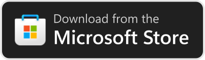
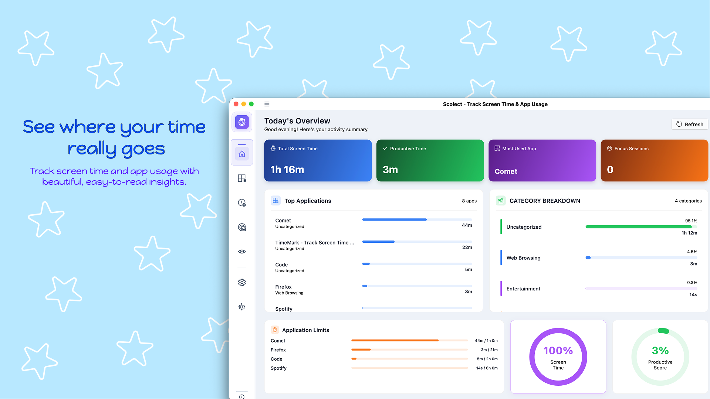
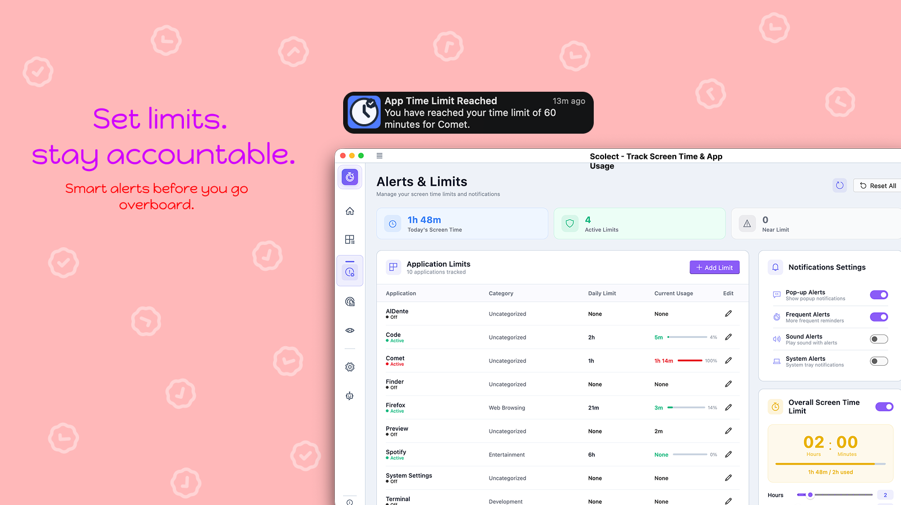
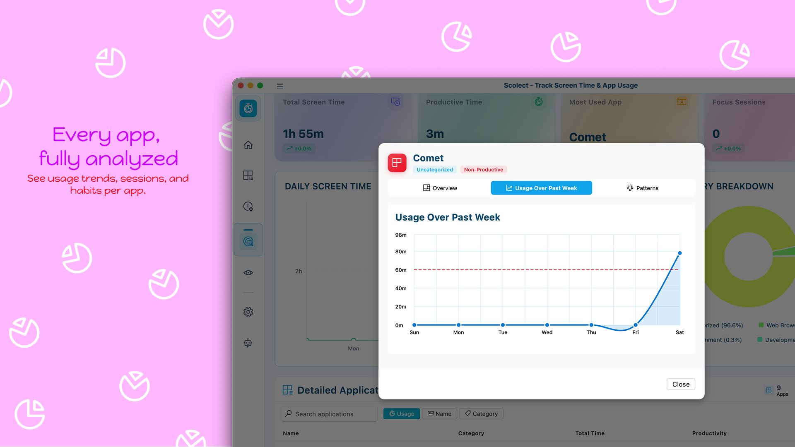
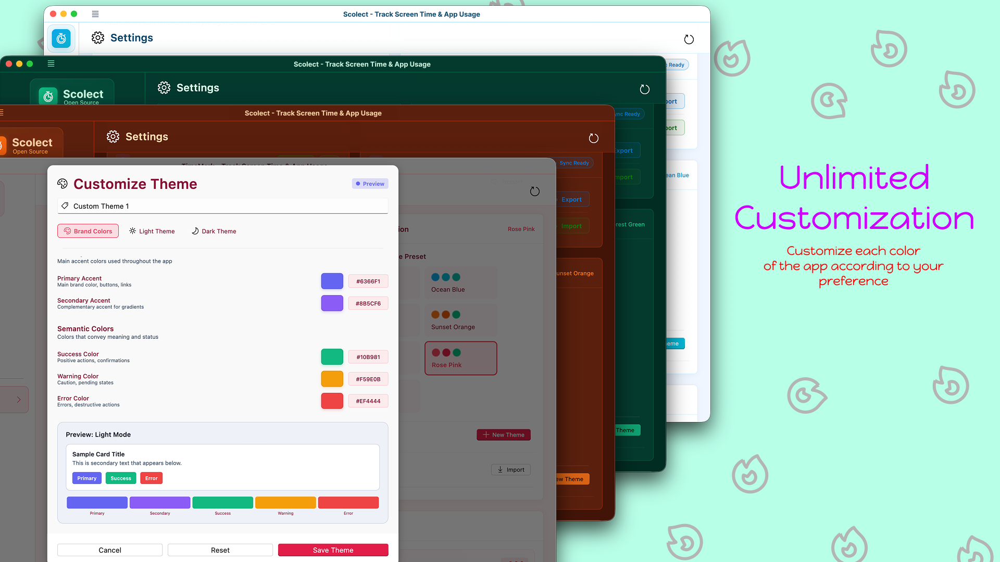
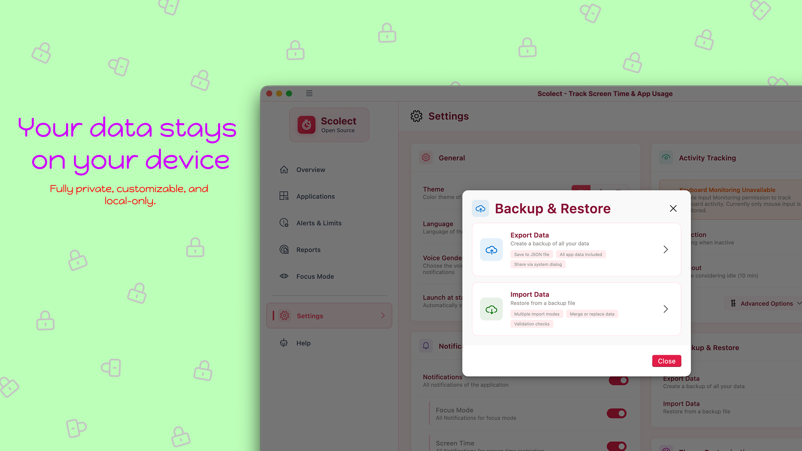
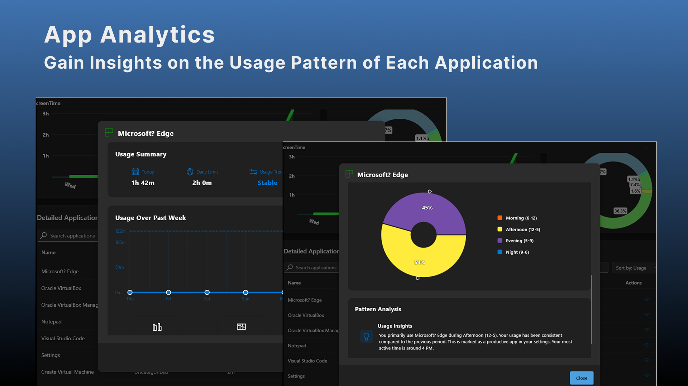
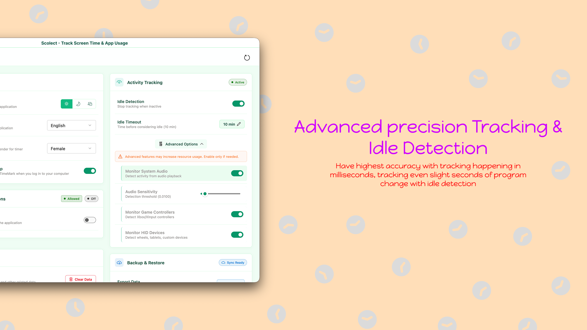
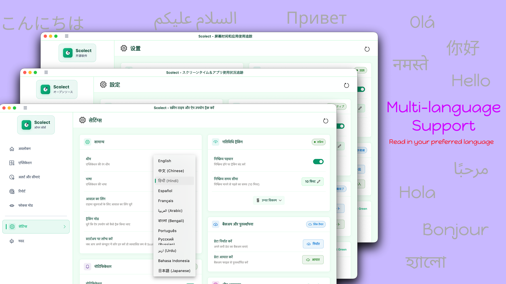

# Scolect - Desktop Screen Time Tracker

<div align="center">

**Take Control of Your Digital Habits**

[](https://apps.microsoft.com/detail/9phbzxnpvhsq?hl=en-US&gl=CA)
[](LICENSE)
[](https://flutter.dev)
[]()
[](https://github.com/HarmanPreet-Singh-XYT/Scolect-ScreenTimeApp)

[Features](#-features) • [Installation](#-installation) • [Usage](#-usage) • [Screenshots](#-screenshots) • [Contributing](#-contributing) • [License](#-license)

</div>

---

## 📖 About

**Scolect** is a comprehensive desktop screen time tracking and productivity application built with Flutter. Understand and manage your digital habits with detailed analytics, intelligent insights, and powerful focus tools to boost your productivity.

### Why Scolect?

- 🎯 **Stay Focused** - Built-in Pomodoro timer with customizable work sessions
- 📊 **Detailed Analytics** - Beautiful charts and reports showing your usage patterns
- 🚀 **Boost Productivity** - Track productive vs. non-productive time
- 🔔 **Smart Alerts** - Customizable notifications when you exceed limits
- 🎨 **Fully Customizable** - Create custom themes, categories, and workflows
- 🔒 **Privacy First** - All data stored locally, no cloud sync required
- 🌍 **Multi-language** - Support for multiple languages
- 💾 **Backup & Restore** - Export and import your data easily
- 🪟 **Native Integration** - System tray support and startup launch

---

## ✨ Features

### 📱 Dashboard & Overview
- **Real-time Tracking** - Today's screen time, productive time, and productivity score
- **Most Used Applications** - See which apps consume most of your time
- **Focus Session Tracking** - Monitor your Pomodoro sessions
- **Application Usage Breakdown** - Visual representation of time distribution
- **Productivity Scoring** - Understand your productivity levels at a glance

### 🖥️ Application Management
- Track screen time for all applications
- Flexible application management with search and filter
- Categorize apps as productive or leisure
- Hide/show specific apps from tracking
- Set individual app time limits
- Customizable tracking settings for each application
- Visibility and productivity tagging

### 📊 Usage Analytics & Reports
- **Daily Trends** - Visual graphs showing usage patterns over time
- **Category Breakdown** - Pie charts showing time distribution across categories
- **Time of Day Analysis** - Morning, afternoon, evening, and night usage patterns
- **Week-over-Week Trends** - Compare your habits across weeks
- **Beautiful Excel Reports** - Export detailed analytics with charts and insights
- **Custom Date Ranges** - Analyze any time period you want
- **Productivity Insights** - Smart recommendations based on your patterns

### 🎯 Focus Mode (Pomodoro Technique)
- **Customizable Timer** - Set your preferred work and break durations
- **Multiple Presets** - Deep Work (60 min), Quick Tasks (25 min), Reading (45 min)
- **Circular Timer Interface** - Beautiful visual countdown
- **Session History** - Track all your focus sessions
- **Focus Trends** - Visualize your productivity patterns over time
- **Break Management** - Automatic break reminders
- **Time Distribution** - See how your focus time is divided

### ⏰ Alerts & Limits
- **Daily Screen Time Limits** - Set overall usage goals
- **Per-App Limits** - Individual time limits for specific applications
- **Comprehensive Controls** - Granular notification management
- **Multiple Alert Types** - Pop-up alerts, system notifications, sounds
- **Flexible Configurations** - Customize when and how you're notified
- **Smart Status Indicators** - Visual feedback on limit status

### 🎨 Customization
- **Theme System** - Light, Dark, and System modes
- **Custom Themes** - Create and save your own color schemes
- **Complete Color Control** - Customize every color in the UI
- **Theme Import/Export** - Share themes with others
- **Live Preview** - See changes in real-time

### 💾 Data Management
- **Backup & Restore** - Export all data to JSON format
- **Import Modes** - Replace, Merge, or Append when importing
- **Data Clearing** - Reset statistics while keeping settings
- **Excel Export** - Beautiful formatted reports with insights
- **Version Information** - Keep track of app updates

### ⚙️ Settings & Configuration
- **Startup Behavior** - Launch at OS startup, minimized launch
- **System Tray Integration** - Minimize to tray for background operation
- **Notification Controls** - Granular control over all notification types
- **Language Selection** - Multiple language support
- **Data Management** - Easy backup, restore, and clear options

---

## 🚀 Installation

### Microsoft Store (Windows)

[](https://apps.microsoft.com/detail/9phbzxnpvhsq?hl=en-US&gl=CA)

**Benefits:**
- ✅ Automatic updates
- ✅ Verified and secure
- ✅ Easy installation and uninstallation
- ✅ Windows integration

1. Click the button above or visit the [Microsoft Store page](https://apps.microsoft.com/detail/9phbzxnpvhsq?hl=en-US&gl=CA)
2. Click "Get" or "Install"
3. Launch Scolect from the Start Menu

### macOS

1. Download the latest `.dmg` file from [Releases](https://github.com/HarmanPreet-Singh-XYT/Scolect-ScreenTimeApp/releases)
2. Open the DMG and drag Scolect to Applications
3. Launch Scolect from Applications

**Note:** On first launch on macOS, you may need to:
- Right-click the app and select "Open" to bypass Gatekeeper
- Grant accessibility permissions for tracking
- Grant input monitoring permissions for keyboard tracking (optional)

### Build from Source

**Prerequisites:**
- Flutter SDK 3.0 or higher
- Dart SDK 2.17 or higher
- Windows development environment

```bash
# Clone the repository
git clone https://github.com/HarmanPreet-Singh-XYT/Scolect-ScreenTimeApp.git
cd Scolect-ScreenTimeApp

# Get dependencies
flutter pub get

# Run the app
flutter run -d windows  # For Windows
flutter run -d macos    # For macOS

# Build release
flutter build windows   # For Windows
flutter build macos     # For macOS
```

---

## 📸 Screenshots

<div align="center">

### Dashboard Overview


### Application Tracking


### Detailed Analysis


### Full Customization


### Local Data


### Focus Mode Pomodoro Timer


### Advance Tracking with idle detection


### MultiLanguage Support


### Scolect 


</div>

---

## 🎯 Usage

### Getting Started

1. **First Launch** - Applications are automatically detected and categorized
2. **Customize** - Mark apps as productive/non-productive in the Applications tab
3. **Set Limits** - Configure daily screen time and per-app limits in Alerts & Limits
4. **Track** - Scolect runs in the background, tracking your usage
5. **Analyze** - View detailed analytics and trends in the Usage Analytics tab
6. **Focus** - Start Pomodoro sessions in Focus Mode to boost productivity

### Quick Tips

- **System Tray** - Minimize to tray to keep Scolect running in the background
- **Focus Mode** - Use the Pomodoro timer to structure your work sessions
- **Reports** - Export beautiful Excel reports for deeper insights
- **Backup** - Regularly backup your data from Settings → Data Management
- **Startup Launch** - Enable "Launch at Startup" for continuous tracking

### Navigation

- 📊 **Dashboard** - Overview of your day
- 🖥️ **Applications** - Manage tracked applications
- 🔔 **Alerts & Limits** - Set usage boundaries
- 📈 **Usage Analytics** - Detailed reports and trends
- 🎯 **Focus Mode** - Pomodoro timer and session tracking
- ⚙️ **Settings** - Customize your experience

---

## 🏗️ Architecture

Scolect is built with:

- **Flutter** - Cross-platform UI framework
- **Fluent UI** - Windows-native design system
- **Hive** - Fast, lightweight local database
- **Shared Preferences** - Quick settings storage
- **fl_chart** - Beautiful charts and graphs
- **Windows FFI** - Native Windows API integration
- **System Tray** - Background operation support

### Key Technologies

- **Visualization**: fl_chart, percentage_indicator, pie_chart
- **Storage**: hive_flutter, shared_preferences
- **Native API**: Windows ForegroundWindow.cpp, ffi
- **UI/UX**: Fluent_UI

<!-- ### Project Structure

```
scolect/
├── lib/
│   ├── main.dart
│   ├── models/          # Data models
│   ├── services/        # Business logic
│   ├── providers/       # State management
│   ├── screens/         # UI screens
│   ├── widgets/         # Reusable widgets
│   └── utils/           # Helpers and utilities
├── assets/
│   ├── icons/
│   ├── images/
│   └── l10n/            # Localization files
└── windows/             # Windows-specific code
    └── runner/
``` -->

<!-- --- -->

## 🌍 Platform Support

### Current
- ✅ **Windows** - Fully supported (Windows 10/11)
  - Microsoft Store distribution
  - Native system integration
  - System tray support
- ✅ **macOS** - Fully supported
  - DMG installer available
  - Native macOS integration
  - System tray support

### Coming Soon
- 🔜 **Linux** - In development

---

## 🤝 Contributing

We love contributions! Whether it's:

- 🐛 Bug reports
- 💡 Feature requests
- 📝 Documentation improvements
- 🌍 Translations
- 💻 Code contributions

### How to Contribute

1. **Fork** the repository
2. **Create** a feature branch (`git checkout -b feature/AmazingFeature`)
3. **Commit** your changes (`git commit -m 'Add some AmazingFeature'`)
4. **Push** to the branch (`git push origin feature/AmazingFeature`)
5. **Open** a Pull Request

### Development Setup

```bash
# Clone your fork
git clone https://github.com/yourusername/Scolect-ScreenTimeApp.git
cd Scolect-ScreenTimeApp

# Add upstream remote
git remote add upstream https://github.com/HarmanPreet-Singh-XYT/Scolect-ScreenTimeApp.git

# Create a branch
git checkout -b feature/my-feature

# Install dependencies
flutter pub get

# Make changes and test
flutter run -d windows

# Commit and push
git add .
git commit -m "Description of changes"
git push origin feature/my-feature
```

### Code Style

- Follow [Effective Dart](https://dart.dev/guides/language/effective-dart) guidelines
- Run `flutter analyze` before committing
- Add comments for complex logic
- Write tests for new features

---

## 🐛 Known Issues

### Windows

- **Issue:** App opens on every startup even when disabled
- **Workaround:** Enable "Launch as Minimized" in Settings

### macOS

- **Issue:** Keyboard tracking requires Input Monitoring permission
- **Solution:** Grant permission in System Preferences → Security & Privacy → Input Monitoring
- **Issue:** App needs accessibility permissions for tracking
- **Solution:** Allow access in System Preferences → Security & Privacy → Accessibility

### All Platforms

- **Issue:** "Hive is not opening" error
- **Solution:** Clear data through Settings or manually delete files in Documents folder

For more issues and solutions, see [Issues](https://github.com/HarmanPreet-Singh-XYT/Scolect-ScreenTimeApp/issues).

---

## ❓ FAQ

<details>
<summary><b>How does Scolect track screen time?</b></summary>

Scolect monitors foreground application activity in real-time using Windows native APIs. It tracks which application is active and records usage duration. All data is stored locally on your device.
</details>

<details>
<summary><b>Is my data private?</b></summary>

Yes! Scolect stores all data locally on your device. There is no cloud sync, no telemetry, and no data collection. Your usage data never leaves your computer.
</details>

<details>
<summary><b>Does Scolect affect system performance?</b></summary>

Scolect is designed to be lightweight with minimal battery and CPU impact. It runs efficiently in the background without affecting your work.
</details>

<details>
<summary><b>Can I use Scolect on multiple devices?</b></summary>

Yes! Use the Backup & Restore feature in Settings to export your data and import it on another device.
</details>

<details>
<summary><b>How do I report a bug?</b></summary>

Open an issue on [GitHub Issues](https://github.com/HarmanPreet-Singh-XYT/Scolect-ScreenTimeApp/issues) or contact support at harmanpreetsingh@programmer.net.
</details>

<details>
<summary><b>Can I customize what apps are tracked?</b></summary>

Absolutely! In the Applications section, you can hide specific apps, disable tracking, or mark apps as productive/non-productive.
</details>

<details>
<summary><b>Is Scolect free?</b></summary>

Yes! Scolect is completely free to download and use from the Microsoft Store.
</details>

---

## 📊 Analytics Export Example

Scolect can generate beautiful Excel reports with:

- 📈 **Summary Sheet** - Key metrics with trends and emoji indicators
- 📅 **Daily Breakdown** - Visual usage patterns with sparklines
- 📱 **Apps Sheet** - Detailed rankings with usage levels
- 💡 **Insights** - Smart recommendations based on your patterns

Example insights:

- "Excellent Productivity: 78% of your screen time is productive work! 🎯"
- "Your most active time is around 3 PM ⏰"
- "Consider setting app limits on leisure applications 🎮"

---
<!-- 
## 🗺️ Roadmap

- [x] Windows support with Microsoft Store distribution
- [x] macOS support with DMG installer
- [x] Pomodoro Focus Mode
- [x] Excel report generation
- [x] Custom themes
- [ ] Linux support
- [ ] Advanced idle detection
- [ ] Audio monitoring
- [ ] Cloud backup (optional)
- [ ] Mobile companion app -->

See [Issues](https://github.com/HarmanPreet-Singh-XYT/Scolect-ScreenTimeApp/issues) for the full list of proposed features and known issues.

---

## 📄 License

This project is licensed under the GNU LESSER GENERAL PUBLIC LICENSE - see the [LICENSE](LICENSE) file for details.

---

## 💖 Acknowledgments

- Built with [Flutter](https://flutter.dev/)
- UI powered by [Fluent UI](https://pub.dev/packages/fluent_ui)
- Charts powered by [fl_chart](https://pub.dev/packages/fl_chart)
- Inspired by productivity tools and time tracking applications

---

## 📧 Contact & Support

- **GitHub Issues**: [Report bugs or request features](https://github.com/HarmanPreet-Singh-XYT/Scolect-ScreenTimeApp/issues)
- **Email**: harman@scolect.com
- **Discord**: @harmanpreet_singh
- **Site**: [scolect.com](https://scolect.com)

---

## 🌟 Support the Project

If you find Scolect useful, please:

- ⭐ Star this repository
- 📢 Share it with others
- ⭐ Rate it on the [Microsoft Store](https://apps.microsoft.com/detail/9phbzxnpvhsq?hl=en-US&gl=CA)
- 🐛 Report bugs and suggest features
- 🤝 Contribute to the codebase\
[](https://buymeacoffee.com/harmanpreetsingh.xyt)


---

<div align="center">

**Created with ❤️ using Flutter**

[⬆ Back to Top](#scolect---desktop-screen-time-tracker)

</div>